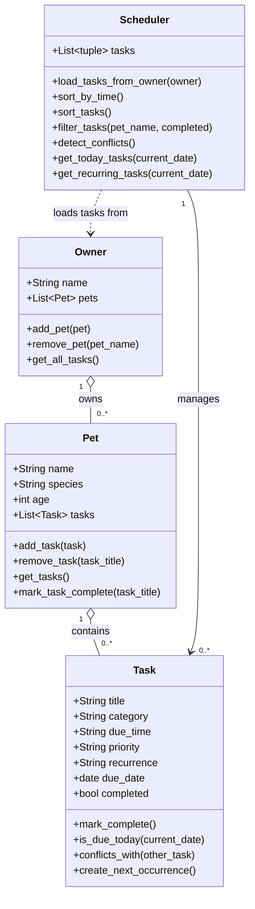

```mermaid
classDiagram
    class Owner {
        +String name
        +List~Pet~ pets
        +add_pet(pet)
        +remove_pet(pet_name)
        +get_all_tasks()
    }

    class Pet {
        +String name
        +String species
        +int age
        +List~Task~ tasks
        +add_task(task)
        +remove_task(task_title)
        +get_tasks()
        +mark_task_complete(task_title)
    }

    class Task {
        +String title
        +String category
        +String due_time
        +String priority
        +String recurrence
        +date due_date
        +bool completed
        +mark_complete()
        +is_due_today(current_date)
        +conflicts_with(other_task)
        +create_next_occurrence()
    }

    class Scheduler {
        +List~tuple~ tasks
        +load_tasks_from_owner(owner)
        +sort_by_time()
        +sort_tasks()
        +filter_tasks(pet_name, completed)
        +detect_conflicts()
        +get_today_tasks(current_date)
        +get_recurring_tasks(current_date)
    }

    Owner "1" o-- "0..*" Pet : owns
    Pet "1" o-- "0..*" Task : contains
    Scheduler "1" --> "0..*" Task : manages
    Scheduler ..> Owner : loads tasks from
```